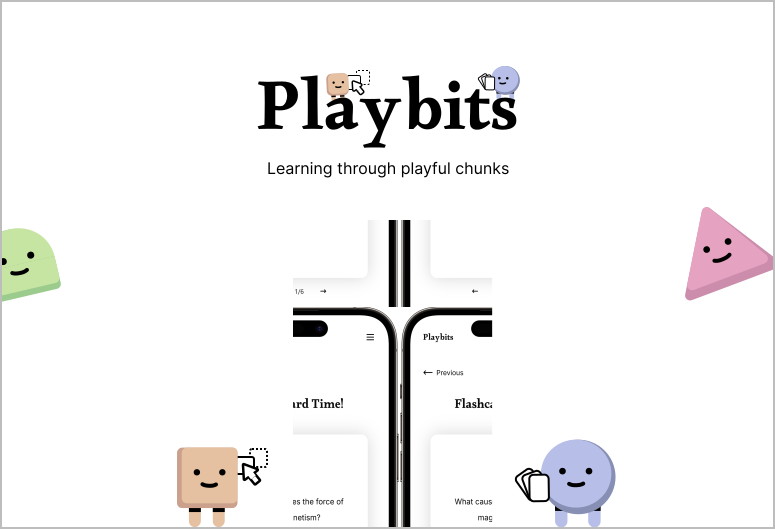

## Playbits

Playbits transforms traditional text-based educational material into an engaging, accessible, and bite-sized revision flow designed for children with focus-related disabilities such as ADHD. It supports effective revision by promoting active recall, reducing cognitive load, and sustaining attention through a sequence of interactive activities - flashcards, flip-and-match games, and fill-in-the-blank challenges.

### Visit Us
Simply visit [https://playbitss-frontend.vercel.app/](https://playbitss-frontend.vercel.app/) to try out our app!

You can create new lesson flows and try them out straight away. 😄


<div align="center">
    
</div>


### Running Locally
To run Playbits locally, you will need to set up the frontend repo (this repo) and the [backend repository](https://github.com/potty10/playbits-backend). Once both have been set up, you are ready to use the application!

#### Set up frontend repo
1. Git clone the repository to your desired folder.
```
git clone https://github.com/eugenetangkj/playbits-frontend.git
```

2. Cd to the above folder. In the directory, run `npm install`.
```
npm install
```

3. Create a .env file in the root repository with the following information.
```
NEXT_PUBLIC_API_BASE_URL = 'http://localhost:8000'
```

4. Start the website on your local server
```
npm run dev
```

5. Visit the website in your browser by typing http://localhost:8000 into the URL. 😄


#### Setup backend repo
1. Git clone  [backend repository](https://github.com/potty10/playbits-backend) to your desired folder.
```
git clone https://github.com/potty10/playbits-backend.git
```

2. Cd to the above folder. In the directory, install the necessary Python dependencies.
```
pip install -r requirements.txt
```

3. Create a .env file in the root repository with the following information. To create the MongoDB URI, you can head to MongoDB Atlas (Cloud) to set up your own cluster and obtain the URI, or use `mongodb://localhost:27017`.
```
OPENAI_API_KEY=<Your OpenAI key here>
MONGO_URI=<Your MongoDB URI here> 
DATABASE_NAME=db_local
```


4. Ensure that you have Docker downloaded.


5. Run MongoDB as container.
```
docker pull mongodb/mongodb-community-server:latest
docker run --name mongodb -p 27017:27017 -d mongodb mongodb-community-server:latest
```

6. Start running API via FastAPI.
```
uvicorn main:app --reload
```
